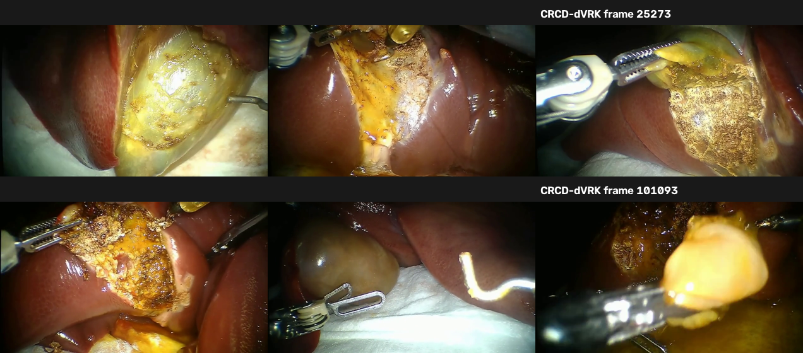
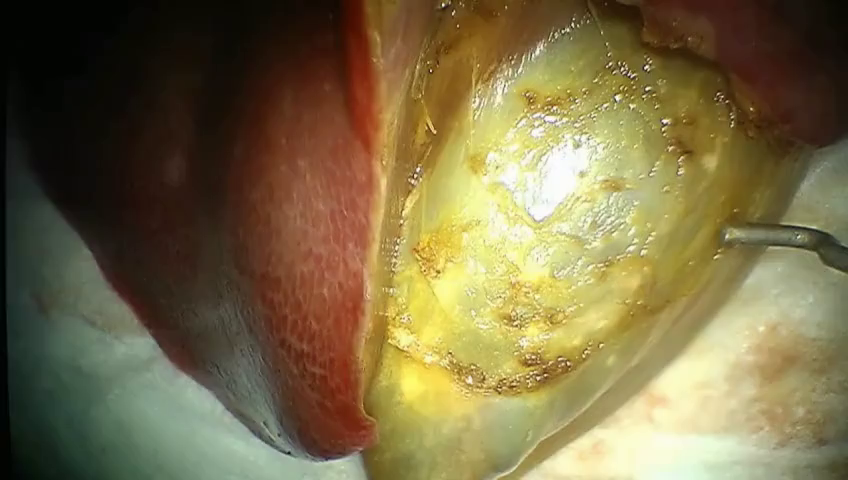
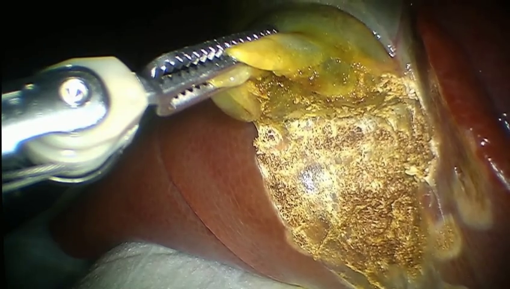
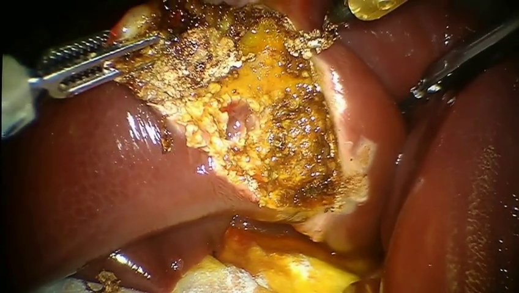
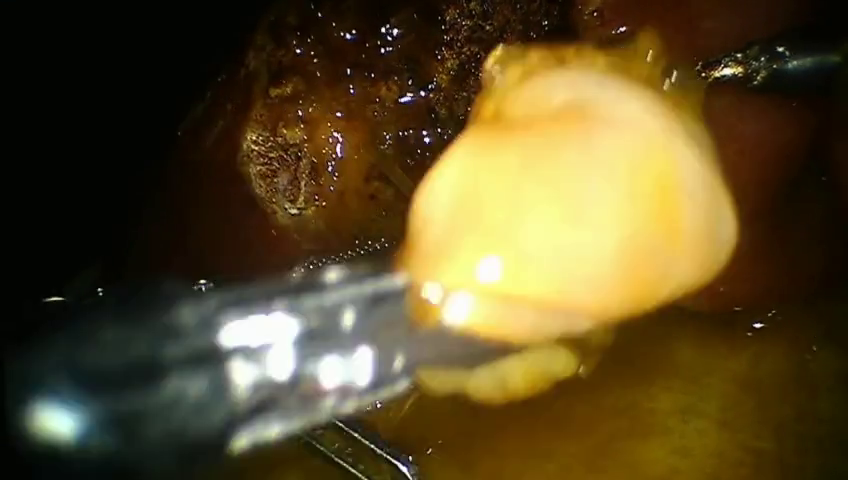

# CRCD-dVRK-LeRobot dataset samples

Real robotic cholecystectomy footage from [morozovdd/CRCD-dVRK-LeRobot](https://huggingface.co/datasets/morozovdd/CRCD-dVRK-LeRobot) on HuggingFace.

- **Robot:** da Vinci Research Kit (dVRK)
- **Resolution:** 848×480 (left endoscope camera)
- **Episodes:** 18 procedures, ~378k frames, ~2.1 GB total
- **Access:** Open download, no registration required

## Gallery (6 frames from one episode)

## Individual frames

| Start of procedure | Grasper retracting tissue |
|--------------------|---------------------------|
|  |  |

| Cautery / dissection | Late procedure |
|----------------------|----------------|
|  |  |
