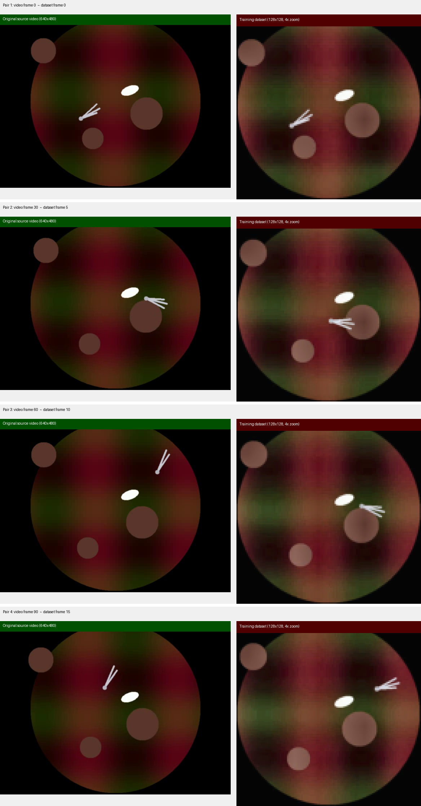
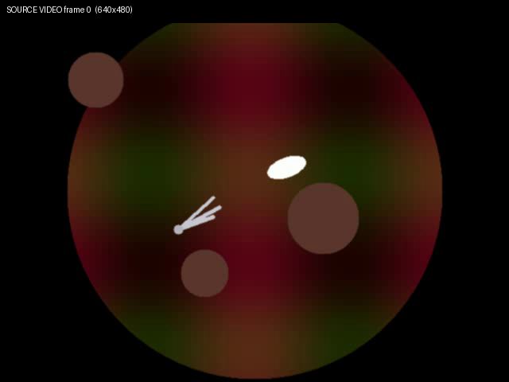
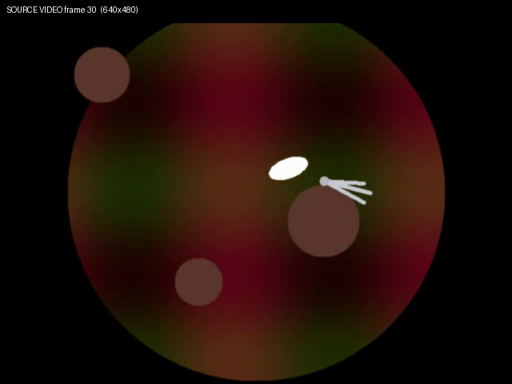
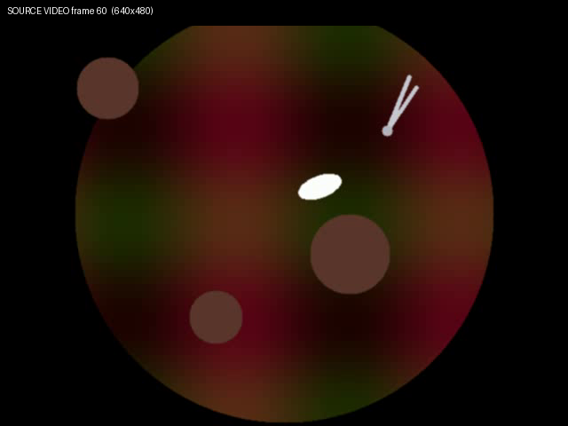
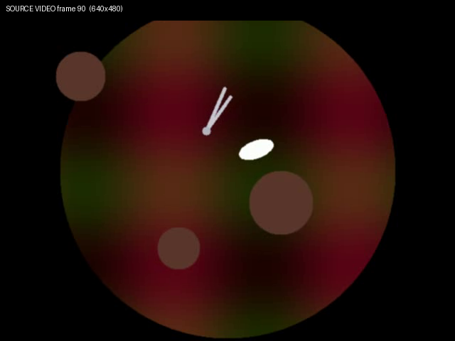
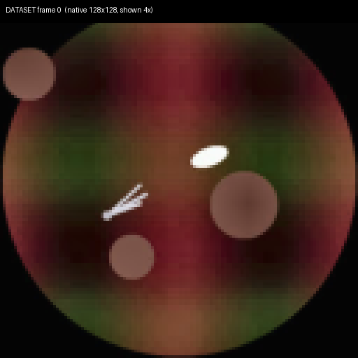
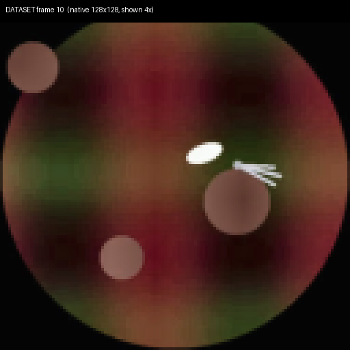
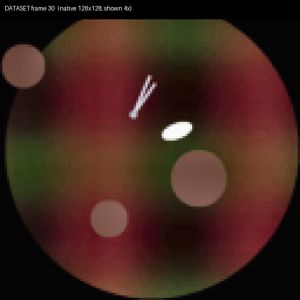

# What the training data actually looks like

**Important:** This run trained on a **synthetic demo video** (`data/surgical/demo/laparoscopic_demo.mp4`), not real Cholec80/HeiChole footage. The scene is stylized circles + a simple instrument — that's why nothing looks like real surgery.

## Source video vs training dataset

The model sees **128×128** downscaled frames. The original source is **640×480**.



- **Left (green):** original source video frame at full resolution
- **Right (red):** same clip after preprocessing into the training HDF5 (128×128, shown 4× zoom)

## Individual source frames (640×480)

These are the actual pixels fed into `prepare_surgical_data.py` before downscaling:

| Frame | Image |
|-------|-------|
| 0 |  |
| 30 |  |
| 60 |  |
| 90 |  |

## Dataset frames (128×128 native, 4× upscaled)

| Frame | Image |
|-------|-------|
| 0 |  |
| 10 |  |
| 30 |  |

## To train on real surgery

Replace the demo video with Cholec80, HeiChole, or your own `.mp4` files:

```bash
python scripts/prepare_surgical_data.py --input /path/to/real/videos/ --resolution 256 256
```

Then re-run the full training pipeline.
