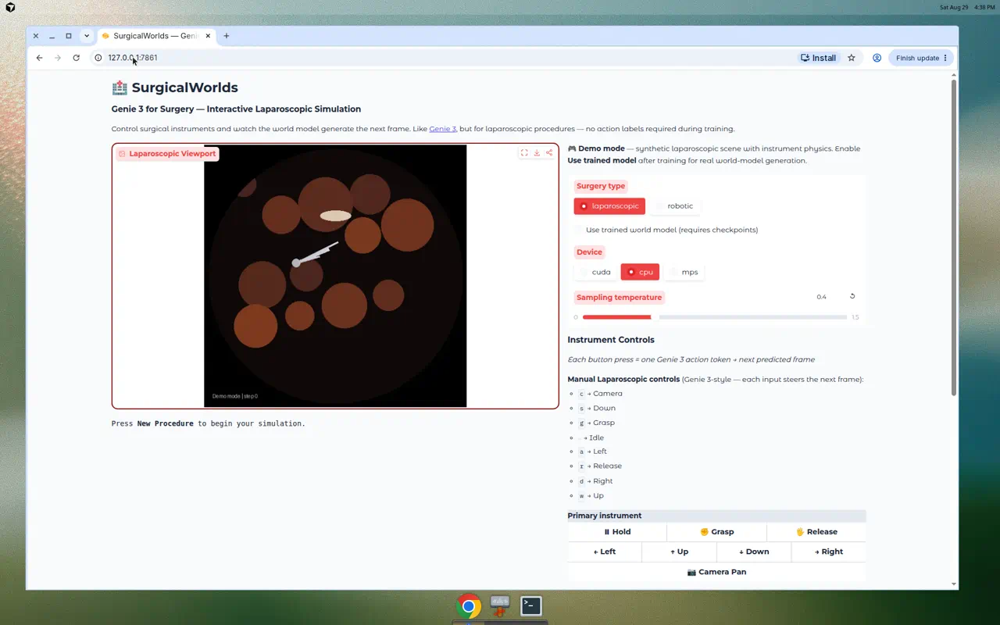
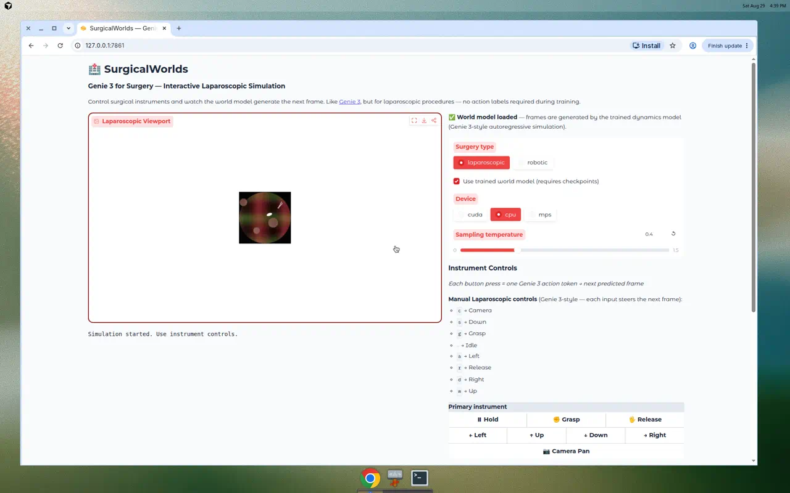
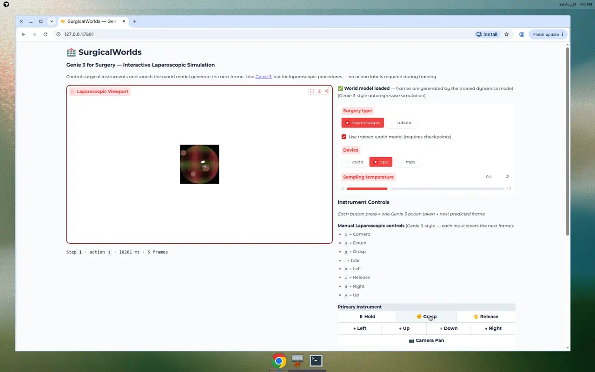

# SurgicalWorlds Simulator — Demo Screenshots

Training completed on Vast.ai instance `49067833` (RTX 3090). These screenshots were captured from a local run using checkpoint `dynamics_step_11500`.

## Quick play

- **Public URL (may expire):** see `SIMULATOR_PUBLIC_URL.txt` in repo root
- **Local:** `python app/surgery_simulator.py` with `NG_RUN_ROOT_DIR` pointing at your run folder
- Enable **"Use trained world model"** → click **New Procedure** → use instrument buttons

## 1. Demo mode (before world model)

Synthetic laparoscopic scene shown when the trained model is not yet enabled.

## 2. World model loaded

After enabling the trained model and starting a new procedure. Green status confirms the dynamics model is active.

## 3. After Grasp action

First instrument action (~18 s on CPU). Frame is generated autoregressively by the trained dynamics model.

## 4. After second action

Second step — model continues predicting laparoscopic frames from action tokens.

## Screen recording

[Download demo video](screenshots/surgery_simulator_world_model_demo.mp4) (MP4, ~5 MB)

## Notes

- Inference was tested on **CPU** (~17–18 s per action). Use **CUDA** on a GPU machine for faster playback.
- The viewport shows a small circular preview; this is a display scaling quirk, not a broken model.
- Checkpoints backed up at `/agent/checkpoint-backups/49067833/latest/` on the training agent.
