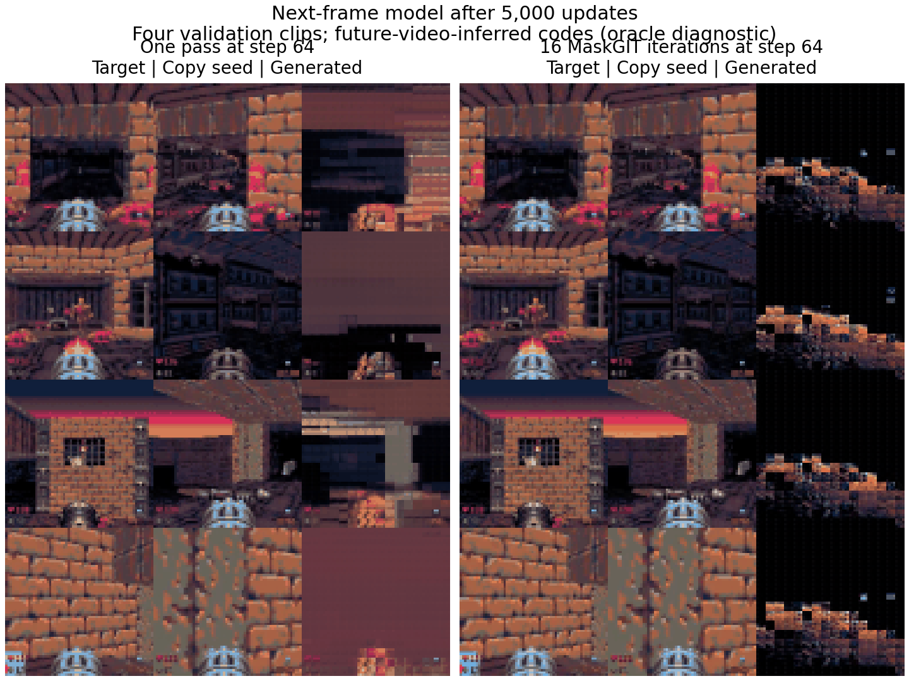
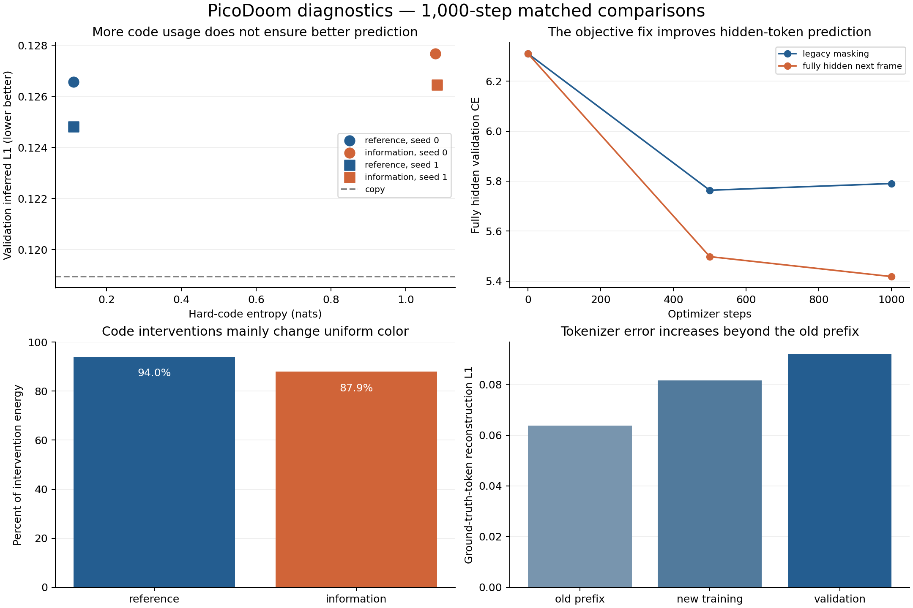

# PicoDoom: bounded GPU findings and the next decision

**Keep the fully hidden next-frame objective and explicit one-pass inference. Defer a larger end-to-end run until the latent-action model demonstrates motion control.** The experiments show real prediction progress, but neither balanced action usage nor lower image error establishes a playable model.

All training was RGB-video-only. No environment action labels, robot kinematics, rewards, or text conditioning were used. The existing architecture and checkpoints were retained for comparisons. No new architecture search or credit top-up was performed.

## What changed

The completed cloud continuation was recovered as a separate commit, `74f2338`, from its original task; the reported `cf2ad11` was not published on GitHub. It fixes undivided loss reporting under accumulation, source-frame-disjoint game-video validation, and an explicit fully hidden next-frame objective while preserving legacy masking.

This investigation adds a bounded GPU runner, deterministic action and generation probes, synthetic motion controls, exact numerical records and W&B artifacts. The production inference method now has an explicit `decoding_mode="one_pass"` option. Its output is tested against the exact helper used in these measurements. MaskGIT remains the default. An iterative step count of 1 previously performed a partial fill plus another forward pass, so it was not equivalent to one-pass prediction.

## Prediction improves; control remains unproven

The matched 1,000-update comparison changes only the dynamics objective, using the same initial weights, batch sampling, optimizer, frozen tokenizer and frozen old LAM.

| Seed | Legacy hidden CE | Next-frame hidden CE | Legacy L1 | Next-frame L1 |
|---|---:|---:|---:|---:|
| 0 | 5.790275 | 5.417718 | 0.140930 | 0.141474 |
| 1 | 5.759421 | 5.412547 | 0.139689 | 0.142507 |

Hidden-token CE improves by about 6.0–6.4% in both seeds. Decoded one-step L1 does not improve at that budget. Partial-reconstruction CE measures a different task and is retained separately in the raw metrics.

After 5,000 next-frame updates, the predeclared final test gives:

| Final-test model | Hidden CE | One-step L1 |
|---|---:|---:|
| Original dynamics@44000 | 6.359967 | 0.150008 |
| Next-frame continuation@5000 | 5.295583 | 0.127448 |
| Copy previous RGB frame | — | 0.108087 |

That is a 16.7% CE reduction and 15.0% L1 reduction versus the original checkpoint. This comparison includes additional training and broader training data as well as the new objective; only the matched 1,000-update comparison isolates the objective. Copying remains better on one-step L1. Motion-weighted errors and the actual reconstruction objective are included so static frames do not determine the conclusion alone.

## A balanced histogram can conceal appearance coding

A soft-information regularizer with weight 0.01 increases hard-code entropy but slightly worsens inferred LAM prediction in both 1,000-update seeds. At 5,000 updates, reference versus regularized validation L1 is 0.121482 versus 0.122644, while entropy is 0.2190 versus 1.3470 nats (maximum ln(4) = 1.3863). Final-test L1 is 0.119600 versus 0.120291; copying is 0.105462.

At 5,000 updates, **94.2% of reference intervention energy and 94.6% of regularized intervention energy is a spatially uniform per-channel color change**, restricting the calculation to codes actually observed on validation. The regularized model uses all four codes. Its codes explain about 64% of source-brightness variation, and its code for a real pair agrees with its repeated-first-frame code in 82.8% of cases, versus a largest code fraction of 36.7%.

These observations support appearance/brightness as a major confound. RGB optical flow is only a descriptive probe, not ground-truth camera motion. Different code outputs or a larger shuffled-action gap do not by themselves establish consistent controls.

## Controlled synthetic motion also fails

For each RGB texture, the fixture supplies four possible successors: four-pixel wraparound translations. All four branches have the identical first image and identical mean color. Training receives only RGB pairs. Validation uses different source textures. Known transformation identities are used only in the evaluation below.

A code-to-translation permutation is chosen on training textures and evaluated on unseen textures. Chance accuracy is 25%.

| Initialization | Variant | Validation mapping accuracy | Scenes with the same code for all four successors |
|---|---|---:|---:|
| Original checkpoint | Reference | 25.0% | 100.0% |
| Original checkpoint | Information penalty | 24.2% | 96.9% |
| Fresh weights | Reference | 25.0% | 100.0% |
| Fresh weights | Information penalty | 24.2% | 96.9% |

The checkpoint-initialized reference improves L1 over copying (0.138774 versus 0.155730) while inferred and shuffled actions remain essentially tied. The regularized model reaches entropy 1.3335 but L1 0.138800. It mainly assigns codes by texture, not successor. Fresh initialization reproduces the failure under this fixed 3,000-update budget, so the result is not confined to reusing the old checkpoint.

This does not prove the architecture can never learn motion. It shows that these concrete recipes have not passed a simple learnability check, making a larger frozen-LAM dynamics run a poor next investment.

## Inference choice matters substantially

The generation probe uses four fixed validation starts and 64 autoregressive steps. Future actions are inferred from recorded RGB video as **oracle diagnostic inputs**; future pixels and tokenizer latents never enter generated history. These are not human-controlled rollouts.

| Model | Direct one-pass L1 at step 64 | 16-iteration L1 at step 64 | Direct median ms/frame | 16-iteration median ms/frame |
|---|---:|---:|---:|---:|
| Original | 0.340584 | 0.333865 | 20.78 | 257.30 |
| Next-frame@1000 | 0.301319 | 0.454513 | 20.54 | 258.71 |
| Next-frame@5000 | 0.272696 | 0.520444 | 20.63 | 257.57 |
| Copy initial RGB frame | 0.280868 | — | — | — |

The 5,000-update one-pass model modestly beats copying at step 64 in this small probe. This is encouraging prediction evidence, not proof of playable control or long-term world consistency. Visual inspection at step 64 shows broad color/brick regions with lost scene geometry in the one-pass output; iterative generation collapses toward similar images across the four contexts. See the saved rollout comparison. Iterative decoding is particularly poor for the fully hidden objective, which does not train on partially filled target frames. Timing is batch-1 GPU generation at 64×64, with logging/sync activity in the background; it excludes UI, network and disk latency.

Re-encoding rendered RGB history is not a consistent remedy. For next-frame@5000, its one-pass step-64 L1 is 0.289959, versus 0.272696 with cached latent history. The ordinary inference script's history handling remains separate from its new decoding option.

## Tokenizer and cheap baselines

The frozen tokenizer's ground-truth-token reconstruction L1 is 0.063765 on the old training prefix, 0.081607 on later training frames, and 0.092125 on validation. These ranges differ in content; the comparison does not isolate overfitting from distribution differences.

About 42.8% of token identities change when the context window shifts. However, validation cached-shift decoding L1 (0.092708) is close to re-encoded-shift decoding L1 (0.092322). Token changes alone therefore do not establish a large decoding bug.

The learned dynamics beats cheap token baselines: validation CE is 6.519721 for global unigrams, 6.422463 for spatial unigrams, and 6.226591 for a copy/unigram mixture whose mixing weight was selected on training data. These baselines help separate actual token-prediction progress from misleading pixel or entropy metrics.

## Compute and next-run gates

The measured tiny configuration reaches roughly 20 LAM or 11 dynamics optimizer updates per second on one RTX 4090, batch 16. Peak allocated GPU memory is approximately 0.42 GB and 2.02 GB respectively. The quoted instance rate, including the selected disk, is $0.32342593/hour.

For this exact configuration, 100,000 updates extrapolate to about 1.4 LAM GPU hours or 2.5 dynamics GPU hours: roughly $0.45 and $0.82 before setup, evaluation, transfers and idle time. The frozen tokenizer is excluded. These are not estimates of the compute required for fully playable PicoDoom; larger models, longer context and higher resolution need a fresh benchmark.

The GPU campaign completed 35,100 optimizer updates across real-video experiments and synthetic controls, plus evaluation-only runs. Completed training jobs account for 42.1 minutes of recorded run time, including their initialization and validation but excluding their final W&B upload waits. Evaluation-only diagnostics, provisioning, analysis, idle time and unusually slow archival transfers add rental time. The post-deletion balance shows **$1.24 spent and $7.42 remaining**. All three task instance IDs are absent and the final cleanup job was deleted; see `bounded_gpu/final_budget.json` for exact balance values and timestamp. The initial authorized balance was $8.66; no funds were added. The campaign stayed below the $2 first-tranche cap.

Before a larger run:

1. Demonstrate above-chance, consistent motion codes on the branched RGB fixture across seeds and unseen textures. Inspect decoder interventions and per-scene code dependence, not only global entropy or L1. A proposed next-campaign gate is at least 75% mapping accuracy on unseen textures in each of three seeds, with visibly correct code interventions and an inferred-action reconstruction advantage over shuffled codes. Freeze that threshold and the step budget before running; it is an engineering gate, not a claim that passing guarantees gameplay.
2. Test one targeted change at a time in the isolated LAM. The existing FiLM conditioning and FSQ bottleneck differ from Genie's additive conditioning and learned VQ codes; neither alternative has been established as a cure here. Do not combine a new quantizer, optimizer, larger model and loss in one comparison. [Genie primary paper, Sections 2–3](https://arxiv.org/html/2402.15391v1).
3. Transfer a successful LAM recipe to real RGB video and verify motion-consistent interventions across unseen scenes, paired inferred/shuffled/constant comparisons, and fidelity. Do not freeze and integrate a LAM solely because its histogram is balanced.
4. Only then train matched dynamics, retain one-pass and legacy generation references, and test longer closed-loop rollouts and human interaction. Use new held-out data for subsequent tuning; the final test in this campaign has been used.

## Evidence, observability and limits

Training ranges are [300,46000), validation [47000,53000), and final test [54000,59785), with source gaps and nonoverlapping sampled clips within each partition. These are temporal splits of one cache, not independently verified episodes. LAM uses two frames; dynamics uses four; stride is two. AdamW uses learning rate 1e-4 (synthetic controls 1e-3), weight decay .01, clip norm 1, float32/TF32, fixed update budgets and reset optimizer state. Original weights are loaded strictly with `weights_only=True`.

W&B records code fractions, hard entropy, continuous latent variance/saturation, gradient histograms, throughput, memory, undivided losses, action ablations, color/motion probes, image grids and rollout videos. Dynamics also recorded parameter histograms. The initial LAM runner bypassed its parent forward method, so the parent W&B watch did not record parameter histograms even though gradients were present. The final runner watches the executed encoder/decoder modules; a 100-update CPU logging fixture verified 121 parameter and 121 gradient histogram series. That fixture is logging validation, not PicoDoom evidence; historical parameter distributions cannot be reconstructed from saved final weights. Configurations, exact source starts, checkpoints and raw numerical logs are also retained. The train/loss metric averages undivided losses since the last log; component terms and encoder diagnostics describe the latest update. Total training loss includes regularizers; validation/objective measures reconstruction. They are not a like-for-like generalization gap.

W&B 0.29 on the host stalled on history/API requests and interrupted one synthetic run in image logging. The failed online attempt remains identified separately in W&B and its saved metadata; the experiment was rerun from the fixed seed offline. Completed optimizer status was verified from result files, not inferred from a crashed dashboard badge. Offline journals were recovered locally and synced from another host. Some artifact uploads referenced unavailable GPU staging paths, so the smaller reviewed evidence artifact retains numerical records and weights; the complete media and journal backup is supplied in the checksum-verified local evidence archive. Uploading the single large combined artifact timed out, so it is not claimed as a completed W&B backup. The reference LAM’s earlier legacy sync duplicated some history rows and omitted its final record; step 5000 was restored explicitly from the original JSONL without new training. Use the saved JSONL for exact aggregation. See the final run index and verification record for actual completion states.

Per-clip standard errors are descriptive: temporal correlation and adaptive validation preclude treating them as independent-sample confidence intervals. Four rollout scenes are insufficient for broad playability claims. All pixels are normalized to [-1,1]. No supervised action labels, robot telemetry, large architecture search, credit top-up or recurring research job was used.

Verification: 16 meaningful CPU tests locally and on the GPU host, the separate 100-update CPU parameter/gradient logging fixture, cloud CPU smoke, the small moving-square diagnostic, compileall, and git diff --check. The explicit one-pass inference output matches the measured helper exactly in the tests, while legacy behavior and CLI defaults remain selectable.

See [RUN_COMMANDS.md](RUN_COMMANDS.md), [BOUNDED_GPU_PLAN.md](BOUNDED_GPU_PLAN.md), `bounded_gpu/summaries.json`, content-hashed split records, source hashes, and per-run configurations/metrics. The exact measured main runner is retained under `bounded_gpu/source_at_run/`; the final runner adds the documented logging fix. The reviewed W&B evidence bundle is `bounded-investigation-reviewed-evidence:v0` (COMMITTED). The full local download is `experiment_evidence.zip`, with a SHA-256 sidecar. Start with the [W&B findings view](https://wandb.ai/data2yihein-d/tinyworlds/runs/1jbhbcyr). Live project: [W&B experiment group](https://wandb.ai/data2yihein-d/tinyworlds/groups/picodoom-bounded-20260905).

