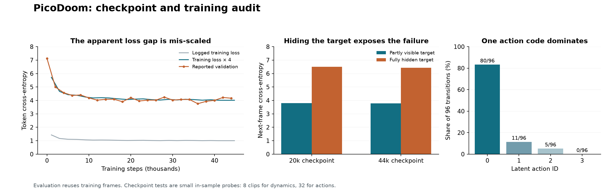

# PicoDoom diagnosis — 5 September 2026

The strongest evidence points to a mismatch between the prediction task used for training and the task required for generation, alongside weak discrete action learning. More training on the current recipe is a poor next experiment. The existing train/validation interpretation also needs correction.

This is an investigation record, not a retraining result. No training implementation was changed and no cloud training was launched.

**User requirement:** keep training unsupervised and video-only, as in DeepMind's Genie. The experiment plan below uses no action labels or robot telemetry as training supervision.

## Evidence and scope

- Audited the PicoDoom branch at commit [`22b7aefa691228d4a189eb4bd5c3d9267f5190ed`](https://github.com/yiheinchai/surgical-worlds/tree/22b7aefa691228d4a189eb4bd5c3d9267f5190ed), rather than assuming the local `main` branch was the run's code.
- Retrieved the three successful runs' configurations, summaries, sampled training histories, and sparse validation histories directly from [W&B](https://wandb.ai/data2yihein-d/tinyworlds/groups/original-PICODOOM-20260903_234048).
- Downloaded the [released checkpoints](https://github.com/yiheinchai/surgical-worlds/releases/tag/original-picodoom-20260904), verified archive SHA-256 `81e61101aaa03e15aca58f762a08f338f856e2f95ab01a4013e87ef7465bcbc7`, and loaded model weights with `weights_only=True`.
- Probed VT@37500, LAM@9500, and dynamics@20000/@44000 in CPU float32. This differs from the GPU mixed precision used in training.
- Sampled 32 four-frame clips, stride 2, with evenly spaced starts from source frames 300 through 2981. These are from the training prefix of [the upstream PicoDoom cache](https://huggingface.co/datasets/AlmondGod/TinyWorlds/blob/main/picodoom_frames.h5). LAM results cover 96 transitions. Dynamics probes use eight of those clips and predict one next frame from three clean context frames, keeping total sequence length at the trained length of four.

These are small, descriptive, in-sample probes. They identify failure modes; they do not establish generalization, reliable action semantics, or the best checkpoint for long rollouts.

Raw diagnostic measurements are in [probe_results.json](probe_results.json). W&B curves and data/masking checks are in [audit_metrics.json](audit_metrics.json).

## 1. The reported generalization gap is misleading

The dynamics loop divides `loss` by `gradient_accumulation_steps` before backpropagation and logs that divided scalar from the final microbatch. Validation logs an undivided mean. This run accumulated four microbatches. Multiplying the logged training value by four recovers the last microbatch's loss, not the exact mean of all four microbatches.

- Last training log, step 45484: **1.06937**, or **4.27747** before division.
- Last validation evaluation, step 44000: **4.16164**.
- Mean corrected training loss over the available sampled logs at steps 40000–45484: approximately **4.010**.

The handoff's persistent three-point train/validation gap is therefore largely a logging artifact. The plateau itself is real: validation falls from 7.12 to 4.02 by 12000, then fluctuates around four through the final checkpoint. Random masks and only four validation batches add noise.

More seriously, `VideoHDF5Dataset` defaults to `disable_test_split=True`. `PicoDoomDataset` leaves that default intact. The factory constructs train and validation instances from the same HDF5 prefix; `train=False` does not activate a split. A probe using the unmodified class definitions and an indexed synthetic cache confirms identical train/validation contents. These curves measure repeated evaluation on training data.

Source: [training loop](https://github.com/yiheinchai/surgical-worlds/blob/22b7aefa691228d4a189eb4bd5c3d9267f5190ed/scripts/train_dynamics.py#L196), [dataset defaults and slicing](https://github.com/yiheinchai/surgical-worlds/blob/22b7aefa691228d4a189eb4bd5c3d9267f5190ed/datasets/datasets.py#L11), [dataset factory](https://github.com/yiheinchai/surgical-worlds/blob/22b7aefa691228d4a189eb4bd5c3d9267f5190ed/datasets/data_utils.py#L27).

## 2. Dynamics almost never trains with a fully hidden target frame

The masking code draws a masking rate between 0.5 and 1, then forces one random temporal anchor visible at every spatial location. With four frames, a given frame retains an expected 25–62.5% of its true tokens. Even at the highest masking rate, the probability of a fully hidden 256-token frame is at most `(3/4)^256`, approximately **1.04e-32**.

The anchor may be in a later frame, which causal attention cannot use to help an earlier prediction. Loss also includes reconstructing masked tokens in the first frame. These are valid inpainting tasks, but they provide a poor match to starting a new, completely masked frame from clean history. Partial target visibility is normal in MaskGIT; the problem here is the effective exclusion of its fully masked starting condition and the different treatment of context.

A controlled checkpoint probe keeps context, actions, scoring positions, and target tokens fixed, changing only whether other true tokens in the target frame remain visible:

| Next-frame token cross-entropy; lower is better | Dynamics@20000 | Dynamics@44000 |
|---|---:|---:|
| Target partially visible | 3.802 | 3.780 |
| Target fully hidden | 6.500 | 6.426 |
| Target fully hidden, actions shuffled | 6.494 | 6.486 |

This is direct evidence that prediction is much worse in the condition needed to begin generation. Shuffling actions has a comparatively small effect in this sample. Shuffling context increases full-target CE from 6.46 to 7.72 at 44000, so the model does use history; it is not completely unconditional.

After 16 deterministic MaskGIT iterations, next-frame L1 is **0.303** at 20000 and **0.222** at 44000, compared with **0.157** for copying the previous frame and **0.060** for decoding ground-truth video tokens. The 44000 checkpoint wins this small one-step test. This does not reproduce or invalidate the earlier subjective preference for 20000 on longer interactive rollouts.

Source: [masking and inference](https://github.com/yiheinchai/surgical-worlds/blob/22b7aefa691228d4a189eb4bd5c3d9267f5190ed/models/dynamics.py#L43).

## 3. The action regularizer can be satisfied while the discrete codes collapse

The action loss only penalizes mean variance of the continuous, pre-quantization outputs below 0.01. It does not require both signs in each binary FSQ dimension, diverse joint codes, useful prediction information, or consistent control semantics. Outputs can vary while remaining on one side of a quantization boundary. Averaging variance across dimensions can also hide an inactive dimension.

W&B reports continuous variance **0.21668** at LAM step 9500, with action entropy **0.50174 nats**, versus `ln(4)=1.386` for a uniform four-code distribution. The variance penalty is inactive at that logged variance. Our checkpoint probe independently finds:

- Code counts **80 / 11 / 5 / 0** across 96 transitions; entropy **0.554 nats**.
- Continuous variance statistic **0.39269**, producing **zero variance penalty**.
- Action ID 0 maps to the quantized vector **(-1, -1)**. It is an arbitrary code identifier, not a zero vector or an established no-op.

The action model has learned some information. With its training-time context mask, shuffling actions worsens the reconstruction objective from **0.05753** to **0.06597**. Calling the latents entirely information-free overstates the evidence. Their semantic meaning and usefulness to dynamics remain poor or unestablished.

The dynamics script explicitly freezes the pretrained LAM parameters. Continuing dynamics training cannot repair that encoder or change its inferred action distribution on a fixed input set.

The loss also rewards a different tradeoff from plain pixel L1:

| Prediction on all 96 transitions | Pixel L1 | Smooth-L1 + spatial-gradient objective |
|---|---:|---:|
| Copy previous frame | 0.1540 | 0.06729 |
| LAM, training context mask | 0.1717 | 0.05753 |

The model beats copying on the objective it actually optimizes while losing on L1. Good-looking loss curves therefore need not imply useful motion. Moving-object metrics and actual action interventions are necessary. A perfectly balanced code histogram would still not prove useful actions.

The LAM decoder already hides every input frame after the first during training; further removing context is not an obvious remedy. Validation turns that mask off via `eval()`, introducing another difference between train and evaluation conditions.

Source: [LAM masking and regularizer](https://github.com/yiheinchai/surgical-worlds/blob/22b7aefa691228d4a189eb4bd5c3d9267f5190ed/models/latent_actions.py#L79), [FSQ mapping](https://github.com/yiheinchai/surgical-worlds/blob/22b7aefa691228d4a189eb4bd5c3d9267f5190ed/models/fsq.py#L17).

## 4. Data and model scale are secondary unresolved constraints

The upstream cache has 59,785 frames. `preload_ratio=0.05` loads to index 2989, then the PicoDoom loader skips the first 300, leaving **2,689 frames and 2,681 overlapping four-frame windows**. This is a short contiguous prefix, not a diverse random 5% subset. The YAML default 0.005 gives an end index of 298, below the start index of 300, explaining the empty-dataset bug.

Checkpoint tensor counts are approximately 0.139M for VT, 0.074M for LAM, and 0.173M for dynamics, consistent with W&B configurations at width 32. Capacity and optimizer settings could limit learning. This audit does not establish how much scaling is necessary. Fixing measurement and task alignment will make a subsequent scale comparison interpretable.

## 5. Keep the surgical goal video-only

The requested research goal includes discovering actions from video. A supervised motion-conditioned replacement would not satisfy it. Treat action information carried by the video as the training signal, and evaluate both prediction and the consistency of interventions.

The current UI's fixed labels such as “grasp” or “left” do not establish the meaning of unsupervised code IDs. Start with anonymous latent buttons and measure their effects across scenes. Predictive information in an inferred code is necessary, but it does not by itself prove the code describes an independently controllable physical action: camera changes, lighting, tissue motion, and tool motion can be mixed together.

## The next experiment

1. **Repair measurement first.** Make an episode-disjoint split, or a temporally separated split with a gap if only one recording exists. Log undivided microbatch-averaged training CE. Fix evaluation clips, masking seeds, and decoding settings. Report one-step and 8–16-step free rollouts alongside copy-frame and motion-aware baselines.
2. **Make a small video-only LAM work.** Start with pairs of frames. The inverse encoder reads both frames and produces a small discrete code; the decoder reads only the first frame and that code, then predicts the second. No true second-frame patches reach the decoder. Use visually varied transitions, including similar starting scenes followed by different motion, so context alone does not determine every target. Overfitting a tiny set checks implementation, then evaluate on separate clips. This is a simplified diagnostic version of Genie's history-conditioned LAM.
3. **Require useful inferred actions.** The code inferred from the actual frame pair must predict its target better than shuffled or fixed codes. Report this difference for LAM and dynamics separately, using pixel fidelity and motion-sensitive measures. Match sampling noise across comparisons. Also hold the starting frame fixed, enumerate codes, and inspect whether each causes consistent plausible motion across scenes. These tests need no action labels. A flat histogram or merely different outputs does not pass the test.
4. **Align dynamics with generation.** Keep the tokenizer fixed. Train on clean history and a fully hidden next frame, conditioned on inferred actions with gradients stopped at the action encoder. Evaluate an isolated masking change using the existing frozen LAM before combining it with an improved LAM. Once next-frame generation works, mix fully hidden and partially masked targets to support iterative MaskGIT decoding. A paired-sequence mask can later recover efficient supervision at every timestep without revealing a clean copy of the target. Freezing stages is for diagnosis; the Genie paper co-trains LAM and dynamics with separate objectives and stopped action gradients into the LAM.
5. **Ablate the departure from Genie before adding more mechanisms.** This implementation uses binary FSQ, a continuous variance floor, FiLM conditioning, and first-frame-only decoder context during LAM training. Genie instead uses a VQ bottleneck with learned code embeddings and reports benefits from additive action embeddings. A small, faithful VQ/additive-conditioning baseline is worth comparing once masking and evaluation are correct. It is not a guaranteed cure: codebook collapse and nuisance encoding still need the tests above. Motion-weighted or residual losses are additional controlled ablations, not a bundle of simultaneous fixes.
6. **Return to surgical video with the same criteria.** Preserve episode boundaries and verify motion survives preprocessing and tokenization. Evaluate image quality, target prediction, and cross-scene action consistency separately. Unsupervised codes need not initially map to the named controls in the UI.

The intended milestone is a video-only model whose inferred discrete actions measurably improve prediction of fully hidden next frames and produce consistent interventions. A longer run of the existing pipeline cannot distinguish which part is preventing that milestone.

## What to take from the linked reading

[Oniris](https://francesco215.github.io/autoregressive_diffusion/) highlights how average pixel objectives can neglect small objects and how carefully structured context/target conditioning enables parallel video prediction. Those are relevant here. Its Gaussian uncertainty loss is not an established cure for discrete action collapse or a categorical dynamics masking mismatch.

[Open-Dreamer](https://next-state.github.io/open-dreamer/) emphasizes a working small-environment reproduction and careful rollout evaluation. Its EMA, precision, and diffusion-loss choices belong to its diffusion recipe. They do not directly resolve the present MaskGIT objective or FSQ bottleneck.

[Genie](https://arxiv.org/html/2402.15391v1) separates video representation, latent-action discovery, and dynamics, and evaluates controllability by changing actions. It also treats action semantics as something to discover or calibrate. Reconstruction, code utilization, next-frame prediction, and controllability are separate achievements.
