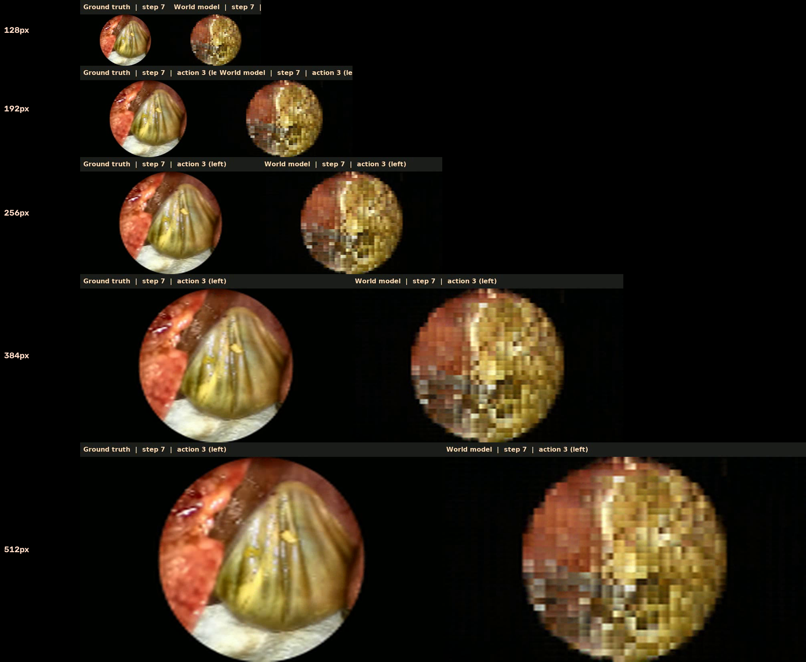

# Resolution comparison (left-then-right demo)

**Model native resolution: 128×128** — all videos below upscale the same model output for display. Inference compute is identical (~320 ms/step on RTX 3090); only video size changes.

| Display height | Panel size | File | Notes |
|----------------|------------|------|-------|
| **128px** | 226×128 | [crcd_left_then_right_128p.mp4](crcd_left_then_right_128p.mp4) | Native 1:1 pixels — sharpest per-pixel, smallest on screen |
| **192px** | 340×192 | [crcd_left_then_right_192p.mp4](crcd_left_then_right_192p.mp4) | Compact; still quite blocky |
| **256px** | 452×256 | [crcd_left_then_right_256p.mp4](crcd_left_then_right_256p.mp4) | **Suggested minimum** for making out tissue/instruments |
| **384px** | 678×384 | [crcd_left_then_right_384p.mp4](crcd_left_then_right_384p.mp4) | Current default demo size |
| **512px** | 906×512 | [crcd_left_then_right_512p.mp4](crcd_left_then_right_512p.mp4) | Largest upscale — same detail, bigger blocks |

## Recommendations

| Goal | Pick |
|------|------|
| Cheapest inference (GPU) | **128px model** + `maskgit_steps=8` — display height does not affect GPU cost |
| Barely usable detail | **256px display** — smallest upscale where structure is visible |
| Comfortable viewing | **384px display** |
| True sharpness (not upscale) | Retrain at `frame_size: 256` (~4× token/compute cost) |

Benchmark (RTX 3090): 16 steps in **5.1 s** → **~319 ms/step**.
